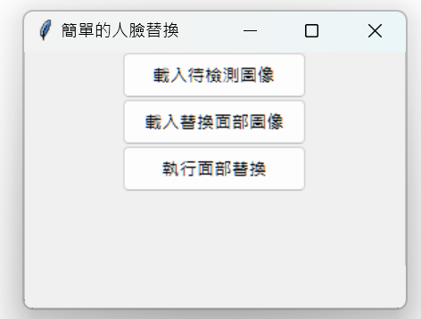

# Simple Face Replacement Application

這是一個使用 Python 和 Tkinter 構建的簡單人臉替換應用程式。使用者可以載入一張圖像和一張替換面部的圖像，然後進行人臉替換，實現簡單的圖片編輯效果。

## 功能

- 載入待檢測的圖像
- 載入替換的面部圖像
- 執行人臉替換
- 顯示替換後的圖像


## 技術棧

- Python
- OpenCV
- Tkinter
- Pillow

## 使用方法

1. 確保已安裝所需的庫：
   ```bash
   pip install opencv-python-headless pillow
   ```

2. 下載或克隆此儲存庫：
   ```bash
   git clone https://github.com/your-username/your-repository-name.git
   ```

3. 進入儲存庫目錄並運行程式：
   ```bash
   python face_replacement.py
   ```

4. 使用應用程式的按鈕載入圖像並進行人臉替換。

## 注意事項

請確保使用的圖像格式為 JPEG 或 PNG，並確保已下載 `haarcascade_frontalface_default.xml` 檔案，該檔案可從 [OpenCV GitHub](https://github.com/opencv/opencv/tree/master/data/haarcascades) 獲取。
